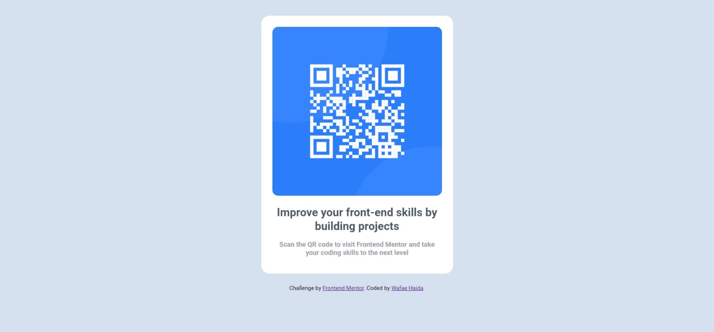

# Frontend Mentor - QR code component solution

This is a solution to the [QR code component challenge on Frontend Mentor](https://www.frontendmentor.io/challenges/qr-code-component-iux_sIO_H).

## Table of contents

- [Overview](#overview)
  - [Screenshot](#screenshot)
  - [Links](#links)
- [My process](#my-process)
  - [Built with](#built-with)
  - [What I learned](#what-i-learned)
  - [Continued development](#continued-development)
  - [Useful resources](#useful-resources)
- [Author](#author)

## Overview

### Screenshot

  

### Links

- Live Site URL: https://wafae-haida.github.io/QR-code-component/

## My process

### Built with

- Semantic HTML5 markup
- CSS custom properties
- Flexbox
- Mobile-first workflow

### What I learned

I learned how to use HTML5 for semantic markup, CSS for styling, and Flexbox for creating responsive layouts. I also explored the box-sizing: border-box; property to ensure consistent element sizing and the importance of media queries for a mobile-first workflow. Additionally, I've effectively integrated these concepts to create a well-structured, responsive webpage.

```html
<h1>Some HTML code I'm proud of</h1>
<meta name="viewport" content="width=device-width, initial-scale=1.0">
<div class="flex-container">
  <div class="container">
  </div>
  <div class="attribution">
  </div>
</div>
```
```css
.proud-of-this-css {
  display: flex;
  justify-content: center;
  align-items: center;
  flex-direction: column;
  height: 100vh;
  gap: 15px;
  box-sizing: border-box;
  padding: 15px;
  max-width: 230px;
  text-align: center;
  font-family: 'Roboto', Arial, sans-serif;
}
```

### Continued development

As a beginner in creating responsive pages, I've learned to use HTML and CSS for foundational web development. I'm excited to tackle more complex challenges with multiple components. I'll focus on mastering Flexbox and Grid layouts, refining media queries, and building reusable components like navigation bars and modals. 

### Useful resources

- [Copilot] - This helped me understand and refine my web development skills. I really liked the clear explanations and practical advice, and I will definitely use these patterns going forward. Huge thanks to my trusty AI companion for guiding me through the process! 🌟
- [w3schools](https://www.w3schools.com/Css/) - This Tutorial provided clear and concise explanations, helping me grasp CSS concepts effortlessly. It’s a fantastic resource for anyone looking to deepen their understanding of CSS. Highly recommended!

## Author

- Website - [Portfolio](http://haida.my-style.in/?i=1)
- Frontend Mentor - [@wafae-haida](https://www.frontendmentor.io/profile/wafae-haida)
- Linkedin - [Wafae Haida](https://www.linkedin.com/in/wafae-haida/?originalSubdomain=ma)